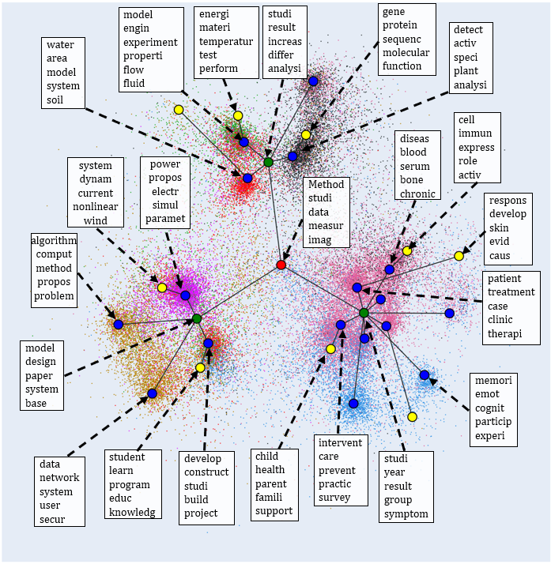

# HTV 

Implementation of "Neural Topic Models for Hierarchical Topic Detection and Visualization"

## Denendency
* Numpy
* TensorFlow
* Networkx

## Preprocessing:
* Check this [repo](https://github.com/misonuma/tsntm) for preprocessing scripts.

## Training:
* train.ipynb: Training example for BBC dataset.

## Visualization example:
* Visualization and hierarchical topics of [WEB OF SCIENCE](https://data.mendeley.com/datasets/9rw3vkcfy4/6)


## Credit:
I adopted most of the code from this [repo](https://github.com/misonuma/tsntm) for building model and training.

## Citing
If you use the data or the model, please cite,
```
@inproceedings{pham2021neural,
  title={Neural topic models for hierarchical topic detection and visualization},
  author={Pham, Dang and Le, Tuan MV},
  booktitle={Machine Learning and Knowledge Discovery in Databases. Research Track: European Conference, ECML PKDD 2021, Bilbao, Spain, September 13--17, 2021, Proceedings, Part III 21},
  pages={35--51},
  year={2021},
  organization={Springer}
}
```
